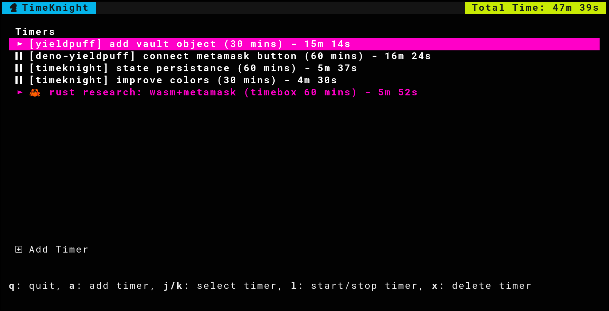

# TimeKnight


TimeKnight is a neat little TUI-based timer app I use in conjunction with a task tracker. It's kind
of a secret sauce for productivity (particularly if you have ADHD or have a ridiculously overactive
brain).

I could never get pomodoro working for me, for a few reasons:

1. **Task-oriented instead of time oriented**: 25-minute interval timers force me to have a break, breaking me out of my "flow state".
2. **Total time**: Breaks were never much of an incentive to work, my problem was distraction, not incentive.
   I noticed that I would feel accomplished by how many pomodoros I would complete, and wondered if
   I could replace this with 'total time spent working' for that day.
3. **Task estimating**: The most important point - pomodoros are only half the story when it comes to timing. I wanted something that would encourage me to break tasks into manageable pieces (< 2 hours each), allow me to estimate tasks briefly and easily switch between tasks if necessary (when blocked on a particular task).
4. **Analytics**: I want to be able to keep these tasks over a long period of time so that I can
   eventually write analytics for the data I collect.

TimeKnight is very simple, and will stay simple. Its main purpose is to keep me focused and improve
my skills for time estimates of small tasks (something sorely underrated in development).

- writes timer data to `~/.timeknight` as `ron` formatted data. You can hand-edit this and check your
  tasks into git easily (for sharing across machines or backing up).
- crash recovery

Here's an example of me using TimeKnight while I code TimeKnight!


## Installation

```bash
cargo install --git https://git.sr.ht/~deathdisco/timeknight
```
